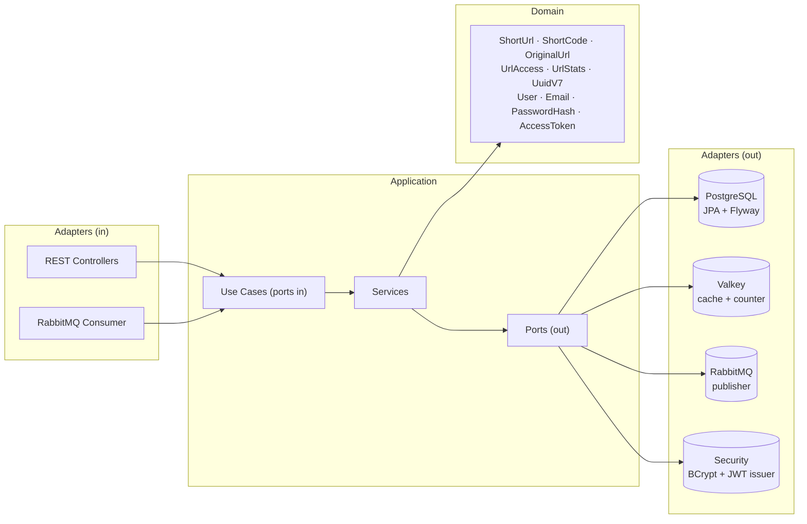

# URL Shortener

A production-grade URL shortener built with **Java 26** and **Spring Boot 4.1**, designed around **Hexagonal Architecture** (Ports & Adapters) with event-driven click analytics, cache-aside resolution, and a test suite enforcing **100% line and branch coverage**.


## Highlights

- **Hexagonal Architecture** — a framework-free domain, use cases exposed as input ports, every technology (Postgres, Valkey, RabbitMQ, Sqids) behind an output port. Dependencies always point inward.
- **Deterministic, non-guessable short codes** — an atomic `INCR` counter in Valkey guarantees collision-free sequences, and [Sqids](https://sqids.org/) with a secret shuffled alphabet makes them non-enumerable.
- **Async click tracking** — redirects never wait for analytics: each access is published to RabbitMQ and persisted by a consumer, keeping the hot path fast.
- **Production-ready messaging** — named direct exchange, explicit bindings, retry with exponential backoff and a dead-letter queue for poison messages.
- **Cache-aside resolution** — resolved URLs are cached in Valkey with a 24h TTL; the database is only hit on cache misses.
- **Stateless JWT authentication** — email/password registration and login issuing HS256-signed JWTs via Spring Security's OAuth2 Resource Server. Passwords hashed with BCrypt behind a domain port; redirects stay public so existing links never break.
- **100% test coverage, enforced** — JaCoCo fails the build below 100% line *and* branch coverage. Integration tests run against real Postgres/Valkey/RabbitMQ via Testcontainers, applying the actual Flyway migrations.

## Architecture



- `domain/model` — pure Java records, zero framework dependencies. Invariants live in compact constructors; static factories (`ShortUrl.record(...)`) encapsulate creation decisions such as time-ordered **UUIDv7** primary keys (hand-rolled, version/variant bits included).
- `application` — input ports (use cases), output ports (repository, cache, publisher, generator) and services that orchestrate them. No infrastructure knowledge.
- `infrastructure` — web controllers with record DTOs, `@RabbitListener` consumer, JPA entities with `fromDomain`/`toDomain` mapping, Valkey and RabbitMQ adapters, configuration.

The code also follows **Object Calisthenics** as a pragmatic guideline: wrapped primitives (`ShortCode`, `OriginalUrl`), early returns instead of `else`, first-class collections (`DailyClickCounts`), small classes and Tell-Don't-Ask.

## Request flows

**Shorten** — `POST /shorten` validates the URL in the domain, gets the next sequence from Valkey (`INCR`), encodes it with Sqids, and persists via JPA. Responds `201` with a `Location` header.

**Redirect** — `GET /{shortCode}` resolves cache-first (Valkey, 24h TTL), falls back to Postgres on miss, publishes an access event to the `url.events` exchange, and responds `302`. Click persistence happens asynchronously in the consumer.

**Stats** — `GET /{shortCode}/stats` aggregates clicks per UTC day with a single `GROUP BY` query; the total is derived in the domain from the daily counts.

**Auth** — `POST /auth/register` validates the email in the domain and stores a BCrypt hash (never the raw password). `POST /auth/login` verifies credentials and answers an HS256-signed JWT carrying the user id (`sub`) and email, valid for 1h. Shortening and stats require the token; redirects are public by design.

## Messaging topology

| Resource | Name | Notes |
|---|---|---|
| Exchange | `url.events` | direct, durable |
| Queue | `url.accessed` | bound with routing key `url.accessed`, DLX configured |
| Dead-letter exchange | `url.events.dlx` | direct, durable |
| Dead-letter queue | `url.accessed.dlq` | receives messages after 3 failed delivery attempts (exponential backoff) |

A message that keeps throwing in the consumer is retried 3 times (500ms initial interval, ×2 multiplier), then rejected without requeue and routed to the DLQ — no infinite redelivery loops, no lost messages.

## API

```http
POST /auth/register
Content-Type: application/json

{ "email": "user@example.com", "password": "secret" }
```

```json
HTTP/1.1 201 Created

{ "id": "0197c9a2-...", "email": "user@example.com" }
```

```http
POST /auth/login
Content-Type: application/json

{ "email": "user@example.com", "password": "secret" }
```

```json
HTTP/1.1 200 OK

{ "accessToken": "eyJhbGciOiJIUzI1NiJ9..." }
```

```http
POST /shorten
Content-Type: application/json
Authorization: Bearer <accessToken>

{ "url": "https://example.com/some/long/path" }
```

```json
HTTP/1.1 201 Created
Location: http://localhost:8080/vS1Ru2

{ "shortCode": "vS1Ru2", "shortUrl": "http://localhost:8080/vS1Ru2" }
```

```http
GET /vS1Ru2          → 302 Found, Location: https://example.com/some/long/path  (public)
GET /vS1Ru2/stats    → 200 OK  (requires Bearer token)
```

```json
{
  "shortCode": "vS1Ru2",
  "originalUrl": "https://example.com/some/long/path",
  "totalClicks": 42,
  "clicksPerDay": [
    { "date": "2026-07-04", "clicks": 40 },
    { "date": "2026-07-05", "clicks": 2 }
  ]
}
```

Errors follow **RFC 9457 Problem Details** via `@RestControllerAdvice`: unknown short code → `404`, malformed input → `400`, email already registered → `409`, invalid credentials or missing/expired token → `401`.

## Testing strategy

| Layer | Approach |
|---|---|
| Domain & services | Plain JUnit 5 + Mockito, no Spring context |
| Web | `@WebMvcTest` slices with mocked use cases, covering the exception handler |
| Adapters | Testcontainers (Postgres 18, Valkey 9, RabbitMQ 4) with real Flyway migrations |
| Messaging | End-to-end: publish → consume → persisted, plus a test proving poison messages land in the DLQ |

Containers use the singleton pattern (started once, shared across test classes) with Spring Boot's `@ServiceConnection`, so `./gradlew check` is fully hermetic — no local infrastructure needed.

**Coverage is a build gate, not a report**: `jacocoTestCoverageVerification` requires 100% line and branch coverage and is wired into `check`. The only exclusion is the bootstrap main class.

## Running locally

Prerequisites: Docker + JDK 26.

```bash
docker compose up -d      # PostgreSQL 18, Valkey 9, RabbitMQ 4
./gradlew bootRun         # starts on http://localhost:8080
./gradlew check           # full test suite + 100% coverage gate (needs only Docker)
```

Configuration of note:

| Variable | Purpose | Default |
|---|---|---|
| `SQIDS_ALPHABET` | Secret shuffled alphabet for short code encoding. **Set your own in production** — it is what prevents code enumeration. | Dev-only alphabet in `application.yaml` |
| `JWT_SECRET` | HS256 signing key (min. 32 bytes). **Set your own in production** — whoever holds it can forge tokens. | Dev-only secret in `application.yaml` |

The database schema is versioned with **Flyway** (`src/main/resources/db/migration`); Hibernate runs with `ddl-auto: validate`, so the migrations are the single source of truth.

## Design decisions

- **UUIDv7 primary keys** — time-ordered UUIDs keep B-tree indexes append-friendly, avoiding the page splits random UUIDv4 causes. Implemented by hand in the domain to keep it dependency-free.
- **Counter + Sqids instead of random codes** — an atomic counter eliminates collisions by construction (the `UNIQUE` constraint remains as a safety net); Sqids with a secret alphabet hides the sequence. Short codes accept 6–10 chars: `minLength(6)` guarantees the minimum, and exceeding 10 would require ~62⁹ URLs.
- **Direct exchange over topic** — there is exactly one event type with an exact routing key; wildcard routing would be speculative. Migrating to a topic exchange later is additive.
- **UTC day bucketing for stats** — deterministic and independent of server timezone; the trade-off (a 21h–00h click in UTC-3 counts toward the next day) is acceptable for aggregate analytics.
- **Total clicks derived from daily counts** — one `GROUP BY` query serves both the total and the per-day series; the domain sums it (`DailyClickCounts.total()`), keeping the endpoint at a single roundtrip.
- **Framework JWT over hand-rolled filters** — token signing and validation delegated to Spring Security's OAuth2 Resource Server instead of a custom `OncePerRequestFilter`; security-critical code is the last place to reinvent. The application layer only sees `TokenIssuer` and `PasswordHasher` ports — JWT and BCrypt are infrastructure details.
- **Stateless sessions, CSRF disabled** — the token travels in the `Authorization` header, never in cookies, so CSRF does not apply and no server-side session state is needed.
- **Uniform login errors** — unknown email and wrong password answer the same `401` message, preventing user enumeration.
